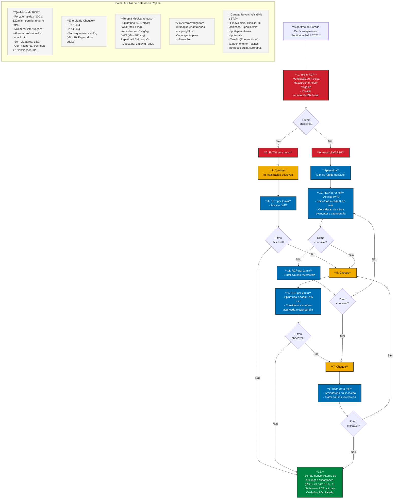

# Algoritmo de Parada Cardiorrespiratória Pediátrica (PALS 2025)

Esse arquivo apresenta o algoritmo principal do PALS renderizado através do Mermaid. Para visualizá-lo, você pode usar a preview do Obsidian, VS Code, Github, ou colar o código no site [Mermaid Live Editor](https://mermaid.live).

