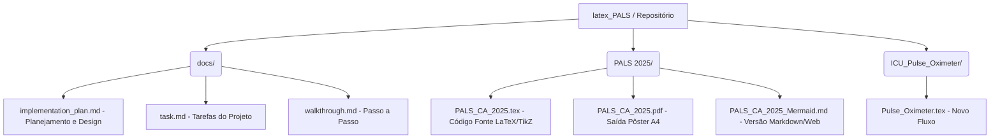

# Projeto LaTeX PALS 2025 & ICU Diagrams

Este repositório contém a refatoração completa e otimização visual de fluxogramas médicos complexos (como o Algoritmo PALS 2025) para formatos altamente profissionais, limpos e escaláveis.

## Estrutura do Repositório

## Nossas Soluções e Aprendizados

Durante o desenvolvimento das nossas páginas e algoritmos, documentamos todo o progresso conceitual:

1. **Reprodutibilidade e Decisões de Design**: Arquivos cruciais como `docs/implementation_plan.md` detalham o motivo de mudarmos para **coordenadas absolutas Cartesianas** (X, Y) no motor do TikZ, impedindo que nós relativos se sobreponham acidentalmente.
2. **Estética Limpa**: Uso de fontes sem-serifa puras (`lmodern`), sombras dinâmicas em caixas coloridas usando padronização da AHA (Associação Americana do Coração) e caixas laterais simétricas para densidade de dado estruturado.
3. **Múltiplos Formatos**: Quando vetores longos complexos falham ou precisam ser exibidos em aplicações baseadas em web (como GitHub ou Obsidian), utilizamos o `Mermaid.js` para garantir 100% de responsividade sem sacrificar a legibilidade do raciocínio médico.

Explore a pasta `docs/` para ver nossos debates anteriores de design e o roadmap completo das atividades entregues!
